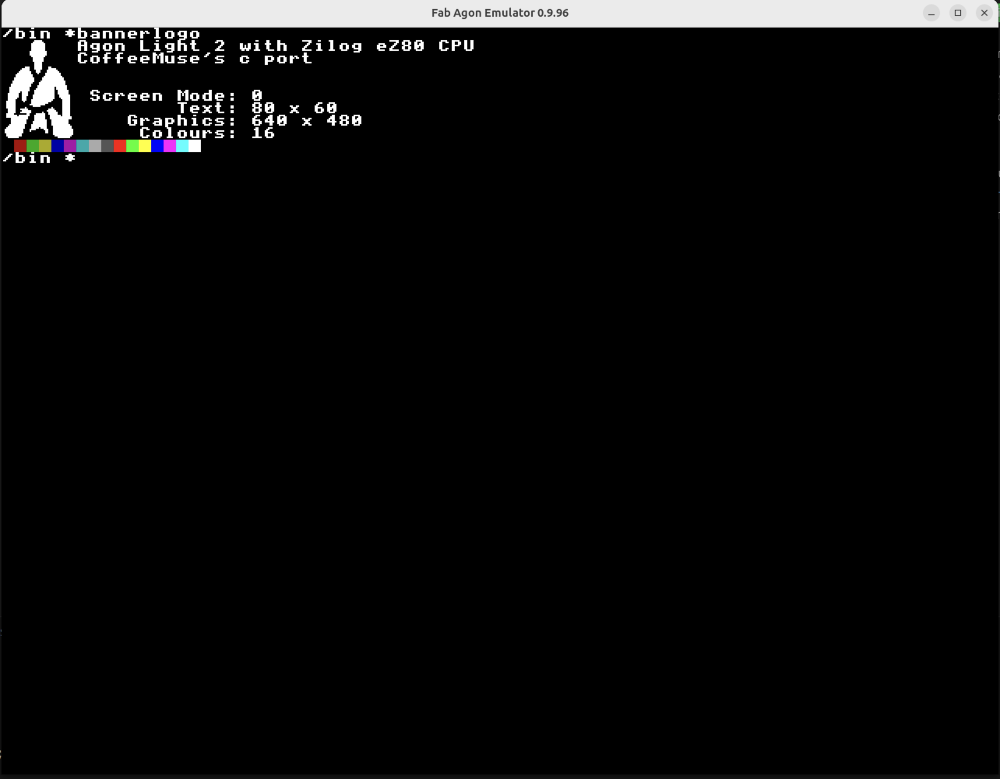

# bannerlogo for AgonLight
[](https://github.com/coffeemuse/bannerlogo/actions)

This project is a C-based reimplementation inspired by the original [bootlogo](https://github.com/sijnstra/agon-projects/tree/main/bootlogo), written in z80 assembly by Shawn Sinjnstra. While not a direct port, it recreates core functionality using similar logic and structure. The original work is licensed under the MIT License, which this project continues to honor.

Initially this project was just a quick playground to test the new [agondev C/C++ Toolchain](https://github.com/AgonPlatform/agondev). Instead of a boring Hello World, I produced this as a learning project.

## Features

- Custom font/logo rendering using Agon VDP
- Displays system information (screen mode, text/graphics resolution, color count)
- Optional color swatch display if no arguments are given
- Demonstrates double-buffered framebuffer handling
- Clean, well-commented code for educational use

## Screenshot



## Build Automation

This project uses [GitHub Actions](https://github.com/features/actions) for continuous integration.  
Every push and pull request to the repository triggers an automated build using the latest [agondev toolchain](https://github.com/AgonPlatform/agondev).  
The resulting binary artifacts are available for download from the "Actions" tab on GitHub.

- See the [latest workflow runs](https://github.com/coffeemuse/bannerlogo/actions) for build status and downloadable binaries.

## Build Instructions

To build this project locally, you need the [agondev C/C++ Toolchain](https://github.com/AgonPlatform/agondev) installed and available in your `PATH`.

1. Clone this repository:
    ```sh
    git clone https://github.com/coffeemuse/bannerlogo.git
    cd bannerlogo
    ```

2. Build the project using `make`:
    ```sh
    make
    ```

This will produce the `bannerlogo` binary in the `./bin` project subdirectory.

To run the program, copy the binary to your AgonLight system or use an emulator such as [Fab Agon Emulator](https://github.com/fabgl/fab-agon-emulator).

## Learning More

- See [`src/main.c`](src/main.c) for the main program logic and comments.
- The code demonstrates custom font loading, querying system variables, and handling both single and double-buffered modes.
- Contributions and suggestions are welcome!

## License

MIT License. See [LICENSE](LICENSE) for details.

